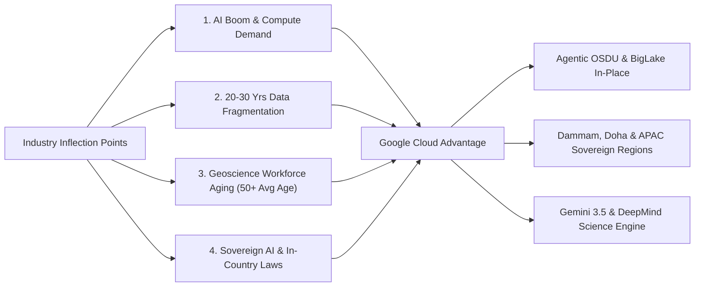
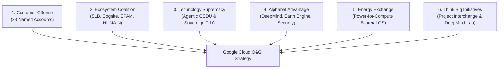
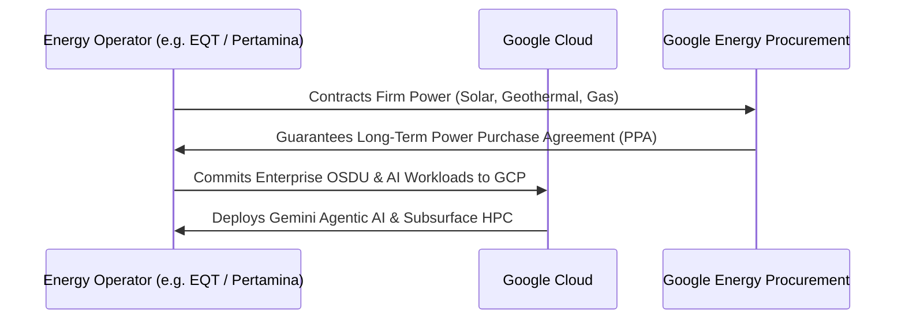
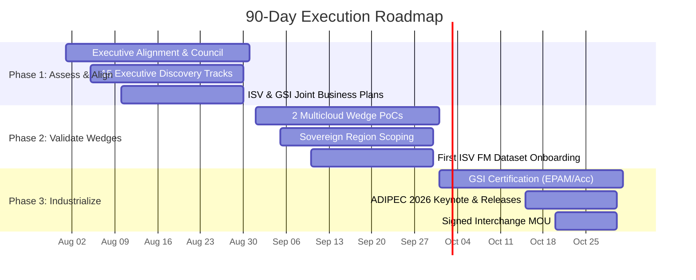

# Google Cloud Oil & Gas Industry Strategy & Execution Plan

**Document Title**: Executive Strategy & Market Execution Roadmap  
**Target Audience**: Google Cloud Executive Leadership (C-Suite, VP Industry Solutions, Regional VPs)  
**Author**: Google Cloud Global Oil & Gas Industry Strategy Team  
**Date**: August 2026  
**Classification**: STRATEGIC EXECUTIVE BRIEFING · CONFIDENTIAL  

---

> [!IMPORTANT]
> **Executive Summary & Sizing the Prize**
> Energy operators represent a **$9.5B Serviceable Addressable Market (SAM)** for Google Cloud by 2028. Driven by the convergence of the **AI inflection point**, an urgent **data fragmentation crisis**, and mandatory **sovereign cloud requirements**, Google Cloud is positioned to expand its market share from **10% today to 20%+ by 2028**, capturing **$1.96B in annual recurring revenue** across named oil & gas accounts.

---

## 1. The Strategic Imperative: Why Oil & Gas Now?

The global oil & gas sector generates **$4.9 Trillion in annual revenue** ([IEA World Energy Outlook](https://www.iea.org/topics/world-energy-outlook)) and spends **$44 Billion annually on IT and digital infrastructure** ([Gartner IT Spending Forecast](https://www.gartner.com/en/newsroom)). However, public cloud adoption in oil & gas currently stands at only **~18%** ([IDC Cloud Tracker](https://www.idc.com/research)).



### Macro Industry Drivers

1. **AI Inflection Point & Compute Demand**: Energy operators sit on both sides of the AI boom — as operators requiring AI to optimize field recovery, and as energy suppliers powering the massive power demand of AI data centers.
2. **Data Fragmentation Crisis**: Operators manage 20–30 years of siloed data across OSDU, PI historians, legacy paper logs, and ERPs. The cost of data fragmentation is now a board-level risk.
3. **Workforce Aging Crisis**: With the average upstream geoscientist age exceeding **50+ years** ([SPE Workforce Survey](https://www.spe.org/en/jpt/jpt-main-page/)), agentic AI that encapsulates domain expertise is a vital workforce continuity strategy.
4. **Sovereign AI Mandates**: NOCs in Saudi Arabia, Qatar, Indonesia, Thailand, and Japan mandate in-country processing under strict national data residency laws ([Saudi NCA Regulations](https://nca.gov.sa/)).
5. **Energy Transition & CCUS**: Annual CCUS investment surpassed **$5B+** ([Global CCS Institute](https://www.globalccsinstitute.com/resources/global-status-report/)), requiring autonomous MRV (Measurement, Reporting, and Verification) software platforms.

---

## 2. Market Opportunity & Sizing the Prize

Google Cloud's addressable market in oil & gas is structured across three concentric tiers, representing a total addressable market of **$21.0B by 2028**:

```mermaid
quadrantChart
    title Google Cloud Market Positioning in O&G
    x-axis Low Technical Differentiation --> High Technical Differentiation
    y-axis Low Revenue Opportunity --> High Revenue Opportunity
    quadrant-1 High-Value Capture (Sovereign NOCs & Upstream AI)
    quadrant-2 Scaled Commodity Cloud (Generic Storage/VMs)
    quadrant-3 Low-Margin Legacy (On-Prem Migration)
    quadrant-4 Wedge Opportunities (BigQuery Omni & Agentic OSDU)
    "AWS (37% Share)": [0.35, 0.85]
    "Azure (32% Share)": [0.45, 0.78]
    "Google Cloud (10% Today)": [0.88, 0.65]
    "Google Target (20% by 2028)": [0.92, 0.90]
```

### Market Sizing Matrix (TAM / SAM / SOM)

| Market Segment | 2028 Valuation | Scope & Definition | Data Source |
|---|---|---|---|
| **Total Addressable Market (TAM)** | **$21.0 Billion** | Total global cloud, data, and AI infrastructure spending across all upstream, midstream, and downstream O&G operators. | [IDC Cloud Tracker / Straits Research](https://www.idc.com/research) |
| **Serviceable Addressable Market (SAM)** | **$9.5 Billion** | High-margin, Google-winnable workloads: Agentic AI, Sovereign NOC cloud, Subsurface HPC, and CCUS MRV. | [Gartner O&G Vertical Analysis](https://www.gartner.com/en/newsroom) |
| **Serviceable Obtainable Market (SOM)** | **$3.2 Billion** | 3-year realistic capture pipeline across 33 named Tier 1–4 accounts and global NOCs. | Google Cloud Internal Pipeline Analysis |

### Cloud Market Share Benchmark (O&G Vertical)

| Cloud Provider | Current Market Share | Key Anchor Accounts | 3-Year Target |
|---|---|---|---|
| **AWS** | **37%** | Shell, Oxy, Aker BP, TGS, ENI, Petrobras | 32% |
| **Azure** | **32%** | Chevron, Equinor, Devon, ADNOC, Petronas | 28% |
| **Google Cloud** | **10%** | Pertamina, PTTEP, Reliance, TotalEnergies (via SLB) | **20% ($1.96B ARR)** |
| **Others / On-Prem** | **21%** | Regional NOCs, Private Datacenters, National Clouds | 20% |

### 5-Year Revenue Projection by Workload Pillar ($ Millions)

| Workload Category | 2024 | 2025 | 2026 | 2027 | 2028 | 5-Yr CAGR |
|---|---|---|---|---|---|---|
| **AI/ML Workloads** | $80M | $140M | $250M | $450M | $750M | **75%** |
| **HPC Seismic & Simulation** | $40M | $65M | $110M | $180M | $280M | **63%** |
| **Data Analytics & OSDU** | $120M | $180M | $260M | $380M | $520M | **44%** |
| **Sovereign Cloud Regions** | $30M | $55M | $95M | $160M | $260M | **71%** |
| **CCUS & Carbon MRV** | $5M | $15M | $40M | $80M | $150M | **134%** |
| **TOTAL REVENUE** | **$275M** | **$455M** | **$755M** | **$1,250M** | **$1,960M** | **48%** |

---

## 3. The 6-Pillar Operating Strategy



### Pillar 1: Customer Offense
Four-tier account attack strategy prioritizing 33 named operators. High-velocity pursuits in Tier 1A (EQT, Devon, Diamondback, Harbour, TGS) combined with sovereign NOC engagement in Tier 2 (Aramco, KOC, Pertamina, PTTEP, Inpex, QatarEnergy).

### Pillar 2: Ecosystem Coalition
Deep co-sell integrations with primary energy ISVs (**SLB Delfi/Sequestri**, **Cognite Data Fusion**, **Baker Hughes Cordant**, **AspenTech**), premier GSIs (**EPAM**, **Accenture**, **TCS/Infosys**), and sovereign AI partners (**HUMAIN AI** in Saudi Arabia).

### Pillar 3: Technology Supremacy
Deploying **Agentic OSDU** and non-OSDU data lakes via BigQuery Omni and BigLake. Providing zero-egress in-place query over incumbent AWS S3 / Azure ADLS repositories paired with TPU v5p/v6 supercomputing clusters for subsurface HPC.

### Pillar 4: Alphabet Advantage
Packaging cross-Alphabet innovations into industrial offerings: **DeepMind** (molecular discovery and weather risk), **Google Earth Engine** (methane monitoring & ROW pipeline tracking), **Workspace with Gemini** (workforce transformation), and **Mandiant/Wiz** (OT/ICS cybersecurity).

### Pillar 5: Energy Exchange
Structuring bilateral industrial deals: Leveraging Google's massive clean energy procurement to contract firm power from energy operators in exchange for enterprise GCP compute and AI transformation commitments.

### Pillar 6: THINK BIG Initiatives
Launching multi-billion-dollar R&D and commercial initiatives: **Project Interchange** (Energy-AI Bilateral OS), **DeepMind Energy Lab** (Frontier materials discovery for hydrogen & CCUS), and **CCUS Transformation Partnerships** with anchor consortia (ExxonMobil LCS, East Coast Cluster, INEOS Greensand).

---

## 4. Customer Revenue Map (33 Named Accounts)

> [!NOTE]
> *Figures below reflect estimated total addressable cloud/AI opportunity per account, 3-year revenue ramp projection, and current pipeline deal stage. "Actual GCP Spend" is managed via CRM/Salesforce records.*

| Account Name | Tier | Region | Incumbent | Strategy Posture | Est. Opp ($M) | 3-Yr Ramp (Y1/Y2/Y3) ($M) | Pipeline Stage |
|---|---|---|---|---|---|---|---|
| **Saudi Aramco** | 2 | MEA | CNTXT / Azure | Lead / Sovereign | **$150M** | [$20M, $60M, $150M] | Qualified |
| **ExxonMobil** | 3 | Americas | Azure | Multicloud Wedge | **$120M** | [$10M, $40M, $80M] | Prospect |
| **TotalEnergies** | 3 | EMEA | Multi | Lead (via SLB) | **$80M** | [$15M, $40M, $80M] | Qualified |
| **QatarEnergy** | 2 | MEA | Greenfield | Sovereign Lead | **$60M** | [$8M, $25M, $60M] | Prospect |
| **Reliance Industries** | 3 | APAC | GCP Anchor | Lead / Expansion | **$60M** | [$18M, $35M, $60M] | Production |
| **BP** | 3 | EMEA | Multi (Azure/AWS) | Multicloud Wedge | **$55M** | [$5M, $20M, $40M] | Prospect |
| **ConocoPhillips** | 1A | Americas | Azure | Multicloud Wedge | **$50M** | [$5M, $15M, $30M] | Prospect |
| **Chevron** | Fortress | Americas | Azure | Co-Exist Wedge | **$50M** | [$5M, $18M, $35M] | Prospect |
| **Pertamina** | 2 | APAC | GCP Anchor | Sovereign Lead | **$45M** | [$12M, $28M, $45M] | PoC |
| **ADNOC** | 2 | MEA | Azure / G42 | Co-Exist / Sovereign | **$45M** | [$5M, $15M, $30M] | Prospect |
| **Petrobras** | 3 | Americas | AWS | Multicloud Wedge | **$45M** | [$5M, $15M, $35M] | Prospect |
| **Devon Energy** | 1A | Americas | Azure | Lead / Win-Back | **$40M** | [$10M, $25M, $40M] | Prospect |
| **KOC / KPC** | 2 | MEA | Greenfield | Sovereign Lead | **$40M** | [$8M, $20M, $40M] | Prospect |
| **Shell** | Fortress | EMEA | AWS | Co-Exist Wedge | **$40M** | [$5M, $15M, $30M] | Qualified |
| **EQT / Expand Energy** | 1A | Americas | Greenfield | Lead / Fast-Track | **$35M** | [$8M, $20M, $35M] | Qualified |
| **Petronas** | 2 | APAC | Azure | Multicloud Wedge | **$35M** | [$5M, $15M, $25M] | Prospect |
| **ENI** | 3 | EMEA | AWS | Multicloud Wedge | **$35M** | [$5M, $15M, $30M] | Prospect |
| **Equinor** | Fortress | EMEA | Azure | Co-Exist Wedge | **$35M** | [$3M, $12M, $25M] | Prospect |
| **PEMEX** | 3 | Americas | Greenfield | Sovereign Lead | **$35M** | [$5M, $15M, $25M] | Prospect |
| **TGS Energy Data** | 1A | EMEA | AWS | Win-Back Pursuit | **$30M** | [$8M, $18M, $30M] | Qualified |
| **Oxy** | Fortress | Americas | AWS | Co-Exist Wedge | **$30M** | [$3M, $12M, $25M] | Prospect |
| **ONGC** | 2 | APAC | Greenfield | Sovereign Lead | **$30M** | [$5M, $15M, $30M] | Prospect |
| **Diamondback** | 1A | Americas | Greenfield | Lead | **$25M** | [$5M, $15M, $25M] | Prospect |
| **Quantum Capital Group** | 1B | Americas | Greenfield | PE Sponsor Platform | **$25M** | [$8M, $18M, $25M] | Qualified |
| **PTTEP** | 2 | APAC | GCP Anchor | Sovereign Production | **$25M** | [$8M, $16M, $25M] | Production |
| **Repsol** | 3 | EMEA | Azure | Multicloud Wedge | **$25M** | [$3M, $10M, $20M] | Prospect |
| **Woodside Energy** | 3 | APAC | AWS | Multicloud Wedge | **$25M** | [$3M, $10M, $20M] | Prospect |
| **Hess Corporation** | 3 | Americas | AWS | Multicloud Wedge | **$25M** | [$3M, $10M, $20M] | Prospect |
| **Harbour Energy** | 1A | EMEA | Greenfield | Lead | **$20M** | [$5M, $12M, $20M] | Prospect |
| **EOG Resources** | 1A | Americas | AWS | Multicloud Wedge | **$20M** | [$3M, $10M, $20M] | Prospect |
| **Continental Resources** | 1C | Americas | Greenfield | Lead | **$20M** | [$5M, $12M, $20M] | Prospect |
| **Inpex** | 2 | APAC | Greenfield | Sovereign Lead | **$20M** | [$3M, $10M, $20M] | Prospect |
| **Santos** | 3 | APAC | AWS | Multicloud Wedge | **$20M** | [$3M, $8M, $18M] | Prospect |
| **YPF** | 3 | Americas | Greenfield | Lead | **$20M** | [$3M, $10M, $18M] | Prospect |
| **Williams Companies** | 4 | Americas | Azure | Midstream Wedge | **$18M** | [$3M, $8M, $15M] | Qualified |
| **Aker BP** | 1A | EMEA | AWS | Multicloud Wedge | **$18M** | [$3M, $8M, $18M] | Qualified |
| **EnCap Investments** | 1B | Americas | Greenfield | PE Sponsor Platform | **$15M** | [$3M, $8M, $15M] | Prospect |
| **Mewbourne Oil** | 1C | Americas | Greenfield | Lead | **$8M** | [$2M, $5M, $8M] | Prospect |

---

## 5. Multicloud Wedge & Sovereign Cloud Architecture


### The Co-Existence Wedge Doctrine

1. **Zero Migration Requirement**: Leave incumbent S3/ADLS repositories untouched. Position BigQuery Omni and BigLake for in-place federated queries over AWS/Azure stores.
2. **Gemini Agentic Reasoning**: Execute long-context reasoning over unstructured LAS/DLIS well logs, seismic surveys, and production reports without moving raw petabytes.
3. **Subsurface HPC Bursting**: Provide TPU v5p/v6 supercomputing clusters for reservoir simulation and reverse time migration (RTM) bursting at 40% lower TCO than AWS EC2.

### Sovereign Region Footprint Matrix

| Sovereign Region | Target Accounts | Governance & Control Model |
|---|---|---|
| **Dammam (`me-central2`)** | Saudi Aramco, CNTXT | Class C CST/NCA certified; CNTXT-operated External Key Management with Key Access Justifications. |
| **Doha Region** | QatarEnergy, LNG Ecosystem | In-country Qatar data boundary; low-latency regional AI inference for LNG shipping & trading. |
| **Jakarta (`asia-southeast2`)** | Pertamina | In-country Indonesia data residency; aligned with Pertamina Digital Hub IT Strategic Plan 2025–2029. |
| **Bangkok (`asia-southeast1`)** | PTTEP | In-country Thailand data residency; Apigee/BigQuery/GKE architecture for Net Zero analytics. |
| **Tokyo / Osaka** | Inpex | In-country Japan data residency; dual-region resilience for Ichthys LNG & CCUS monitoring. |
| **GDC Air-Gapped** | Kuwait NOCs, ADNOC OT | Disconnected Google Distributed Cloud hardware deployed directly on-premise at critical OT sites. |

---

## 6. Competitive Intelligence & Capability Matrix

```mermaid
radar
    title Capability Comparison: GCP vs AWS vs Azure
    axes Reasoning AI, Subsurface HPC, Multicloud In-Place, Sovereign Cloud, CCUS MRV, Power Exchange
    "Google Cloud": [95, 90, 95, 90, 85, 95]
    "AWS": [70, 85, 60, 65, 75, 40]
    "Azure": [75, 70, 55, 80, 70, 50]
```

### Head-to-Head Capability Matrix

| Strategic Capability | Google Cloud | AWS | Microsoft Azure | Google Competitive Advantage |
|---|---|---|---|---|
| **Agentic AI & Reasoning** | **Gemini 3.5 / 3.6 (1M+ Token)** | Bedrock / Claude 3.5 | Azure OpenAI / GPT-4o | Long-context multimodal reasoning over full seismic & well log repositories. |
| **Multicloud In-Place Query** | **BigQuery Omni & BigLake** | Redshift Spectrum | Synapse Link | Zero-egress query execution over incumbent AWS S3 / Azure ADLS lakes. |
| **Subsurface HPC Compute** | **TPU v5p / v6 Supercomputers** | EC2 UltraClusters | H100/H200 VMs | 40% lower TCO for massive seismic inversion & reservoir simulation sweeps. |
| **Sovereign Cloud Controls** | **KSA (Dammam), Doha, GDC Airgap** | AWS Top Secret | Azure Sovereign | Direct partnership with CNTXT (KSA) and disconnected GDC Air-Gapped hardware. |
| **Energy Procurement OS** | **Project Interchange** | Clean Energy Contracts | PPA Deals | Bilateral OS: Swapping data center power demand for enterprise cloud commitments. |
| **CCUS & Carbon Accounting** | **SLB Sequestri + Earth Engine** | AWS Carbon | Azure Sustainability | Integrated satellite methane monitoring (MethaneSAT) + SLB reservoir modeling. |

---

## 7. Strategic "Think Big" Initiatives

### Project Interchange: Energy-AI Bilateral Operating System
Project Interchange establishes a bilateral commercial framework with energy majors. Google Cloud contracts firm clean power generation (solar, geothermal, nuclear) from operators (e.g., EQT, Pertamina, TotalEnergies) to supply Google's expanding AI data center estate. In return, the operator commits their enterprise IT, OSDU data lakes, and AI workloads to Google Cloud.



### DeepMind Energy Lab: Frontier Science Engine
The DeepMind Energy Lab accelerates frontier R&D for energy transformation:
- **Molecular Discovery (GNoME & AlphaFold 3)**: Computational screening of 100,000+ candidate solvent molecules for CCUS carbon capture and novel corrosion-resistant alloys for H₂ pipeline blending.
- **Physics Simulation (TORAX Architecture)**: Differentiable neural proxy simulators executing full-physics reservoir simulations **10,000× faster** than legacy solvers.
- **Autonomous Operations**: Reinforcement learning policies for real-time autonomous drilling control and process safety precursor detection.

### CCUS Transformation Partnerships
In partnership with **SLB (Delfi/Sequestri)**, Google Cloud establishes strategic technology partnerships with anchor CCUS consortiums:
1. **ExxonMobil Low Carbon Solutions**: Intelligent Gulf Coast Hub platform for multi-tenant carbon accounting and EPA Class VI compliance.
2. **East Coast Cluster (BP / Equinor / TotalEnergies)**: Neutral multi-operator CCUS intelligence platform.
3. **INEOS Greensand (Denmark)**: Enterprise cloud expansion leveraging existing SLB Delfi deployment on GCP.

---

## 8. Execution Roadmap & Leadership Alignment



### 30-60-90 Day Execution Workstreams

| Execution Phase | Focus Theme | Key Exit Deliverables |
|---|---|---|
| **Days 1–30** | **Assess, Align & Activate** | • Global O&G Deal & Product Council operationalized.<br/>• Top 33 accounts scored on priority heat map.<br/>• 15 customer discovery tracks opened (Pertamina, PTTEP, EQT, Devon).<br/>• Project Interchange framework ratified with Google Energy Procurement. |
| **Days 31–60** | **Validate Wedges & Sovereignty** | • 2 multicloud wedge validations live (1 AWS, 1 Azure).<br/>• Sovereign AI roadmaps signed for Aramco (Dammam) and Pertamina (Jakarta).<br/>• First ISV dataset onboarded to Vertex AI for Foundation Model pre-training. |
| **Days 61–90** | **Scale, Accelerate & Penetrate** | • 3 solution kits shipped; EPAM & Accenture certified on Agentic OSDU.<br/>• Marquee customer announcements locked for **ADIPEC 2026**.<br/>• 1 Project Interchange MOU signed; 1 DeepMind Energy Lab partnership signed. |

### Strategic Objectives (OKRs)

- **OKR 1**: Sign **3–5 Tier 1 accounts** (EQT, Devon, Diamondback) with ≥1 live in production on Agentic OSDU.
- **OKR 2**: Validate **2 multicloud wedges** in AWS/Azure fortress accounts (Shell, Chevron) with zero migration escalations.
- **OKR 3**: Ratify **1 Gulf NOC sovereign PoC** (Aramco/KOC) and launch HUMAIN AI enablement on Dammam `me-central2`.
- **OKR 4**: Achieve **≥30% partner-originated pipeline** via SLB, Cognite, Baker Hughes, EPAM, and Accenture.
- **OKR 5**: Embed **3 Alphabet modules** (Earth Engine, WeatherNext, Mandiant) across active account pursuits.
- **OKR 6**: Execute **1 signed Project Interchange MOU** and **1 DeepMind Energy Lab research partnership** at ADIPEC 2026.

### Executive Decisions Required from Google Leadership

> [!CAUTION]
> **Executive Alignment & Resource Requests**
> 1. **Resource Concentration**: Ratify the 33-account focus model, assigning direct P1 executive sponsors.
> 2. **Engineering Staffing**: Formally assign Google product/engineering leads to the 6 Agentic OSDU reference patterns.
> 3. **Sovereign Region Investment**: Accelerate feature parity for Dammam (`me-central2`) and Doha regions.
> 4. **Project Interchange Approval**: Authorize Google Energy Procurement to structure bilateral power-for-compute deals with EQT and Pertamina.

---

### Footnotes & Data Sources
- [IEA World Energy Outlook 2025](https://www.iea.org/topics/world-energy-outlook) — Global Energy Demand & Revenue Benchmarks
- [Gartner IT Spending Forecast Q2 2025](https://www.gartner.com/en/newsroom) — Vertical IT Expenditure Metrics
- [IDC Cloud Tracker 2025](https://www.idc.com/research) — Enterprise Public Cloud Adoption Rates
- [Precedence Research](https://www.precedenceresearch.com/artificial-intelligence-in-oil-and-gas-market) — Artificial Intelligence in Oil & Gas Market Projection ($5.4B by 2035)
- [MarketsandMarkets](https://www.marketsandmarkets.com/Market-Reports/digital-oilfield-solutions-market-528.html) — Digital Oilfield Market Forecast ($43.0B by 2029)
- [Global CCS Institute Status Report](https://www.globalccsinstitute.com/resources/global-status-report/) — Global CCUS Project & Investment Tracker
- [SPE Journal of Petroleum Technology](https://www.spe.org/en/jpt/jpt-main-page/) — Upstream Geoscience Workforce & Digital Energy Surveys
